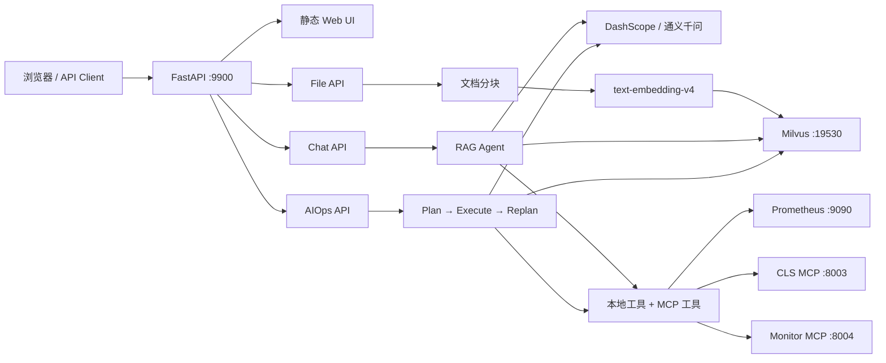
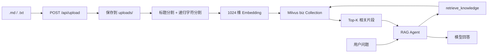
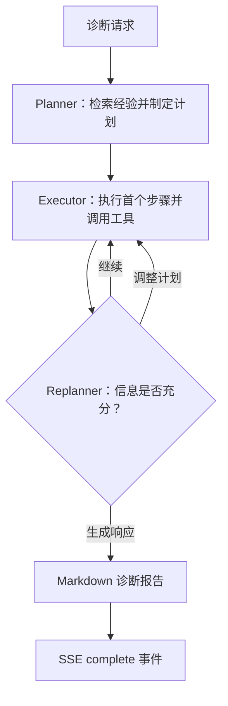

# SuperBizAgent

> 基于 FastAPI、LangChain/LangGraph、通义千问、Milvus 与 MCP 的智能
> OnCall 助手，提供多轮对话、RAG 知识库问答、Prometheus 告警查询和
> Plan-Execute-Replan 自动故障诊断。

[](https://www.python.org/)
[](https://fastapi.tiangolo.com/)
[](https://langchain-ai.github.io/langgraph/)
[](https://milvus.io/)
[](#许可证)

## 项目简介

SuperBizAgent 是一个面向运维和企业知识场景的全栈 Agent 示例项目。它将
对话模型、知识库检索、监控告警、日志/指标工具和自动诊断工作流组合在一个
Web 应用中：

- 用户可以通过浏览器进行普通或 SSE 流式对话。
- Agent 可以检索上传到 Milvus 的 Markdown/TXT 知识。
- Agent 可以读取 Prometheus 当前告警。
- AIOps 工作流会先规划、逐步调用工具、动态重规划，再输出 Markdown
  诊断报告。
- MCP 客户端可以同时接入本地或托管的日志、监控工具服务。

当前仓库适合作为本地演示、Agent 工作流验证和二次开发基础。内置 CLS 与
Monitor MCP Server 返回的是模拟数据；生产环境需要接入真实日志与监控平台。

## 核心能力

| 能力 | 实现 | 当前状态 |
| --- | --- | --- |
| 多轮对话 | LangChain Agent + LangGraph `MemorySaver` | 可用，进程内会话 |
| 流式响应 | FastAPI + SSE | 可用 |
| RAG 检索 | DashScope Embedding + Milvus | 可用，需 API Key 和 Milvus |
| 文档入库 | Markdown/TXT 分块、向量化、增量覆盖 | 可用，单文件最大 10 MB |
| Prometheus 告警 | `/api/v1/alerts` HTTP API | 可用，需 Prometheus |
| AIOps 诊断 | Planner → Executor → Replanner | 可用 |
| MCP 工具 | `streamable-http` / `sse` | 可用 |
| CLS 日志工具 | 本地 FastMCP Server | 模拟数据 |
| CPU/内存工具 | 本地 FastMCP Server | 模拟数据 |
| Web UI | 原生 HTML/CSS/JavaScript | 可用 |

## 系统架构



### RAG 文档链路



文档分块使用两阶段策略：

1. Markdown 先按一级、二级标题切分。
2. 再以 `CHUNK_MAX_SIZE × 2` 为最大长度递归切分。
3. 小于 300 字符的片段会在尺寸允许时与相邻片段合并。
4. 每个片段保留来源文件、扩展名、文件名和 Markdown 标题元数据。
5. 重复上传同一路径的文件时，先删除旧来源片段，再写入新向量。

### AIOps 诊断链路



- Planner 会先检索内部知识库，再结合本地和 MCP 工具生成执行步骤。
- Executor 通过模型的 Tool Calling 选择并执行工具。
- Replanner 可继续、替换剩余计划或直接生成最终响应。
- 工作流最多执行 8 个步骤，避免无限重规划。
- 诊断输出包括计划、步骤状态、最终报告和完成事件。

## 技术栈

### 后端与 Agent

- Python 3.11–3.13
- FastAPI、Uvicorn、SSE Starlette
- LangChain、LangGraph、LangChain MCP Adapters
- `langchain-qwq` / `ChatQwen`
- Pydantic Settings
- Loguru

### 模型与数据

- 阿里云 DashScope 通义千问
- `text-embedding-v4`，固定输出 1024 维向量
- Milvus 2.5.10
- MinIO + etcd
- Prometheus HTTP API

### 前端

- 原生 HTML、CSS、JavaScript
- Marked.js
- Highlight.js
- 浏览器 `localStorage` 会保存最多 50 条本地会话记录

## 环境要求

- Python `>=3.11,<3.14`，仓库默认版本为 Python 3.13
- Docker Desktop，或 Docker Engine + Docker Compose v2
- 阿里云 DashScope API Key
- 推荐安装 [uv](https://docs.astral.sh/uv/)
- 可选：GNU Make（Linux/macOS 的一键管理命令）
- 可选：Prometheus（需要查询真实活动告警时）

> 应用模块加载阶段就会初始化 Embedding 和 Milvus VectorStore，因此
> `DASHSCOPE_API_KEY` 必须有效，且 Milvus 必须先启动。

## 快速开始

### 1. 获取代码

```bash
git clone https://github.com/hanghopetofly-coder/OnCall-agent.git
cd OnCall-agent
```

### 2. 安装依赖

推荐使用 uv：

```bash
uv sync
```

需要开发工具时：

```bash
uv sync --extra dev
```

也可以使用标准虚拟环境：

```bash
python -m venv .venv

# Linux/macOS
source .venv/bin/activate

# Windows PowerShell
.\.venv\Scripts\Activate.ps1

pip install -e .
```

### 3. 配置环境变量

在项目根目录创建 `.env`：

```dotenv
# 应用
APP_NAME=SuperBizAgent
APP_VERSION=1.2.1
DEBUG=false
HOST=0.0.0.0
PORT=9900

# DashScope
DASHSCOPE_API_KEY=your-dashscope-api-key
DASHSCOPE_API_BASE=https://dashscope.aliyuncs.com/compatible-mode/v1
DASHSCOPE_MODEL=qwen-max
DASHSCOPE_EMBEDDING_MODEL=text-embedding-v4

# Milvus
MILVUS_HOST=localhost
MILVUS_PORT=19530
MILVUS_TIMEOUT=10000

# RAG
RAG_TOP_K=3
RAG_MODEL=qwen-max
CHUNK_MAX_SIZE=800
CHUNK_OVERLAP=100

# MCP
MCP_CLS_TRANSPORT=streamable-http
MCP_CLS_URL=http://localhost:8003/mcp
MCP_MONITOR_TRANSPORT=streamable-http
MCP_MONITOR_URL=http://localhost:8004/mcp

# Prometheus
PROMETHEUS_BASE_URL=http://127.0.0.1:9090
PROMETHEUS_REQUEST_TIMEOUT=10
```

不要提交 `.env`。仓库中的 `.gitignore` 已忽略该文件。

### 4. 启动向量数据库

```bash
docker compose -f vector-database.yml up -d
docker compose -f vector-database.yml ps
```

首次启动需要拉取镜像并等待 Milvus 健康检查通过。

### 5. 启动 MCP Server

分别打开两个终端：

```bash
uv run python mcp_servers/cls_server.py
```

```bash
uv run python mcp_servers/monitor_server.py
```

MCP 不可用时，普通对话 Agent 会退化为仅使用本地工具；AIOps
Planner/Executor 当前会直接请求 MCP 工具列表，因此完整诊断建议启动两个服务。

### 6. 启动主应用

```bash
uv run uvicorn app.main:app --host 0.0.0.0 --port 9900
```

启动完成后访问：

- Web UI：<http://localhost:9900>
- Swagger UI：<http://localhost:9900/docs>
- ReDoc：<http://localhost:9900/redoc>
- 健康检查：<http://localhost:9900/health>
- Attu 管理界面：<http://localhost:8000>
- MinIO Console：<http://localhost:9001>

### 7. 导入示例运维知识

逐个上传 `aiops-docs/` 中的 Markdown 文件：

```bash
for file in aiops-docs/*.md; do
  curl -X POST "http://localhost:9900/api/upload" \
    -F "file=@${file}"
done
```

也可以调用目录索引接口：

```bash
curl -X POST \
  "http://localhost:9900/api/index_directory?directory_path=aiops-docs"
```

## 一键启动

### Linux/macOS

```bash
make init
```

`make init` 会启动 Docker 服务、MCP Server 和 FastAPI，并等待健康检查后上传
`aiops-docs/` 中的文档。

常用命令：

```bash
make start          # 启动应用与 MCP 服务
make stop           # 停止应用与 MCP 服务
make restart        # 重启
make up             # 启动 Milvus Compose
make down           # 停止 Milvus Compose
make status         # 查看 Docker 状态
make status-mcp     # 查看 MCP 状态
make upload         # 上传 aiops-docs
make logs           # 查看应用日志
make help           # 查看全部命令
```

### Windows

在 Docker Desktop 已启动的前提下运行：

```powershell
.\start-windows.bat
```

脚本会创建/同步虚拟环境、启动 Milvus、两个 MCP Server、FastAPI，并自动上传
`aiops-docs`。停止全部服务：

```powershell
.\stop-windows.bat
```

## 服务与端口

| 服务 | 默认端口 | 用途 |
| --- | ---: | --- |
| FastAPI / Web UI | 9900 | API、静态前端、Swagger |
| Attu | 8000 | Milvus Web 管理 |
| CLS MCP | 8003 | 日志主题与日志查询 |
| Monitor MCP | 8004 | CPU、内存指标查询 |
| MinIO API | 9000 | Milvus 对象存储 |
| MinIO Console | 9001 | MinIO 管理界面 |
| Milvus | 19530 | 向量数据库 |
| Milvus Health | 9091 | Milvus 健康检查 |
| Prometheus | 9090 | 外部告警数据源，项目不会自动启动 |

## 配置参考

Pydantic Settings 会读取根目录 `.env`，变量名大小写不敏感。

| 变量 | 默认值 | 说明 |
| --- | --- | --- |
| `APP_NAME` | `SuperBizAgent` | 应用名称 |
| `APP_VERSION` | `1.0.0` | API 展示版本 |
| `DEBUG` | `false` | 调试模式和日志级别 |
| `HOST` | `0.0.0.0` | 监听地址 |
| `PORT` | `9900` | 监听端口 |
| `DASHSCOPE_API_KEY` | 空 | 必填，模型和 Embedding 密钥 |
| `DASHSCOPE_API_BASE` | DashScope 兼容地址 | ChatQwen 使用的兼容 API 地址 |
| `DASHSCOPE_MODEL` | `qwen-max` | 通用 Chat 模型 |
| `DASHSCOPE_EMBEDDING_MODEL` | `text-embedding-v4` | Embedding 模型 |
| `RAG_MODEL` | `qwen-max` | RAG 和 AIOps 使用的模型 |
| `RAG_TOP_K` | `3` | 知识检索返回条数 |
| `CHUNK_MAX_SIZE` | `800` | 基础分块大小 |
| `CHUNK_OVERLAP` | `100` | 分块重叠字符数 |
| `MILVUS_HOST` | `localhost` | Milvus 地址 |
| `MILVUS_PORT` | `19530` | Milvus 端口 |
| `MILVUS_TIMEOUT` | `10000` | 连接超时，毫秒 |
| `MCP_CLS_TRANSPORT` | `streamable-http` | CLS MCP 传输模式 |
| `MCP_CLS_URL` | `http://localhost:8003/mcp` | CLS MCP 地址 |
| `MCP_MONITOR_TRANSPORT` | `streamable-http` | Monitor MCP 传输模式 |
| `MCP_MONITOR_URL` | `http://localhost:8004/mcp` | Monitor MCP 地址 |
| `PROMETHEUS_BASE_URL` | `http://127.0.0.1:9090` | Prometheus 地址 |
| `PROMETHEUS_REQUEST_TIMEOUT` | `10.0` | Prometheus 请求超时，秒 |

MCP 地址与传输模式需要匹配：

- 本地 FastMCP `/mcp` 地址使用 `streamable-http`。
- 部分托管服务的 `/sse/` 地址使用 `sse`。

## API 参考

| 方法 | 路径 | 说明 |
| --- | --- | --- |
| `GET` | `/` | Web UI |
| `GET` | `/health` | 应用与 Milvus 健康检查 |
| `POST` | `/api/chat` | 一次性对话 |
| `POST` | `/api/chat_stream` | SSE 流式对话 |
| `POST` | `/api/chat/clear` | 清除服务端会话 |
| `GET` | `/api/chat/session/{session_id}` | 查询服务端会话 |
| `POST` | `/api/upload` | 上传并索引 Markdown/TXT |
| `POST` | `/api/index_directory` | 索引服务端目录 |
| `POST` | `/api/aiops` | SSE 自动诊断 |

### 普通对话

请求字段兼容别名 `Id` / `Question` 和字段名 `id` / `question`。

```bash
curl -X POST "http://localhost:9900/api/chat" \
  -H "Content-Type: application/json" \
  -d '{
    "Id": "session-123",
    "Question": "数据库连接超时应该如何排查？"
  }'
```

响应示例：

```json
{
  "code": 200,
  "message": "success",
  "data": {
    "success": true,
    "answer": "……",
    "errorMessage": null
  }
}
```

### 流式对话

```bash
curl -N -X POST "http://localhost:9900/api/chat_stream" \
  -H "Content-Type: application/json" \
  -d '{
    "Id": "session-123",
    "Question": "结合知识库分析 CPU 使用率过高"
  }'
```

SSE 的 `data` 是 JSON，主要类型包括：

| 类型 | 含义 |
| --- | --- |
| `content` | 模型文本片段 |
| `tool_call` | 工具调用状态，接口已预留 |
| `search_results` | 检索结果，接口已预留 |
| `done` | 流式回答结束 |
| `error` | 错误信息 |

### 清除和读取会话

```bash
curl "http://localhost:9900/api/chat/session/session-123"
```

```bash
curl -X POST "http://localhost:9900/api/chat/clear" \
  -H "Content-Type: application/json" \
  -d '{"sessionId":"session-123"}'
```

服务端会话由 `MemorySaver` 保存在当前 Python 进程内；进程重启后不会保留。
浏览器端同时使用 `localStorage` 保存本地展示历史，两者并非同一个持久化存储。

### 文件上传

```bash
curl -X POST "http://localhost:9900/api/upload" \
  -F "file=@aiops-docs/cpu_high_usage.md"
```

限制：

- 支持 `.md`、`.txt`。
- 单文件最大 10 MB。
- 同名文件会覆盖 `uploads/` 中的旧文件。
- 文件保存成功但向量索引失败时，接口仍可能返回 200；应同时检查服务日志。

### AIOps 诊断

```bash
curl -N -X POST "http://localhost:9900/api/aiops" \
  -H "Content-Type: application/json" \
  -d '{"session_id":"diagnosis-001"}'
```

主要 SSE 事件：

| 类型 | 阶段 | 内容 |
| --- | --- | --- |
| `plan` | `plan_created` | 诊断步骤列表 |
| `step_complete` | `step_executed` | 当前完成步骤和剩余数量 |
| `status` | `replanner` 等 | 工作流状态 |
| `report` | `final_report` | Markdown 报告 |
| `complete` | `diagnosis_complete` | 最终诊断对象 |
| `error` | `error` / `exception` | 错误信息 |

## Agent 工具

### 本地工具

| 工具 | 用途 |
| --- | --- |
| `retrieve_knowledge` | 从 Milvus 检索相关知识片段 |
| `get_current_time` | 获取指定时区当前时间 |
| `query_prometheus_alerts` | 查询 Prometheus 当前 pending/firing 告警 |

Prometheus 告警以完整 labels 作为唯一身份，结果按 `activeAt` 从新到旧排序，
并返回状态分布和持续时间。

### CLS MCP Server（模拟数据）

| 工具 | 用途 |
| --- | --- |
| `get_current_timestamp` | 获取毫秒时间戳 |
| `get_region_code_by_name` | 地区名称转地区代码 |
| `get_topic_info_by_name` | 按名称查日志主题 |
| `search_topic_by_service_name` | 按服务名模糊/精确查主题 |
| `search_log` | 按主题和时间范围搜索日志 |

### Monitor MCP Server（模拟数据）

| 工具 | 用途 |
| --- | --- |
| `query_cpu_metrics` | 生成指定时间范围的 CPU 指标 |
| `query_memory_metrics` | 生成指定时间范围的内存指标 |

要用于生产环境，应将两个 MCP Server 中的 Mock 数据逻辑替换为真实的
CLS、Prometheus、Grafana、云监控或内部可观测平台 API。

## Milvus 数据模型

应用使用固定名称 `biz` 的 Collection：

| 字段 | 类型 | 说明 |
| --- | --- | --- |
| `id` | `VARCHAR(100)` | UUID 主键 |
| `vector` | `FLOAT_VECTOR(1024)` | 文档向量 |
| `content` | `VARCHAR(8000)` | 分块正文 |
| `metadata` | `JSON` | 来源、文件名、标题等 |

向量索引为 `IVF_FLAT`，距离度量为 `L2`，`nlist=128`，查询时
`nprobe=10`。

> 重要：启动时如果检测到已有 `biz` Collection 的向量维度不是 1024，
> 当前实现会删除并重建该 Collection。生产环境变更 Embedding 维度前必须备份
> 数据，并设计显式迁移流程。

## 项目结构

```text
OnCall-agent/
├── app/
│   ├── agent/
│   │   ├── aiops/                  # Planner、Executor、Replanner、状态
│   │   └── mcp_client.py           # 多 MCP 客户端、重试与错误展开
│   ├── api/
│   │   ├── aiops.py                # AIOps SSE API
│   │   ├── chat.py                 # 普通/流式对话和会话 API
│   │   ├── file.py                 # 上传与目录索引 API
│   │   └── health.py               # 健康检查
│   ├── core/
│   │   ├── llm_factory.py          # OpenAI 兼容 Chat 模型工厂
│   │   └── milvus_client.py        # Collection、索引、连接管理
│   ├── models/                     # Pydantic 请求/响应模型
│   ├── services/
│   │   ├── aiops_service.py        # LangGraph AIOps 工作流
│   │   ├── rag_agent_service.py    # 对话 Agent 与内存会话
│   │   ├── document_splitter_service.py
│   │   ├── vector_embedding_service.py
│   │   ├── vector_index_service.py
│   │   ├── vector_search_service.py
│   │   └── vector_store_manager.py
│   ├── tools/                      # 知识、时间、Prometheus 告警工具
│   ├── utils/logger.py             # Loguru 配置
│   ├── config.py                   # 环境变量配置
│   └── main.py                     # FastAPI 入口
├── aiops-docs/                     # 示例运维知识库
├── mcp_servers/
│   ├── cls_server.py               # 模拟日志 MCP
│   ├── monitor_server.py           # 模拟指标 MCP
│   └── README.md
├── static/
│   ├── index.html
│   ├── app.js
│   └── styles.css
├── Makefile
├── pyproject.toml
├── pyrightconfig.json
├── start-windows.bat
├── stop-windows.bat
├── uv.lock
└── vector-database.yml
```

## 日志与数据目录

- 应用日志：`logs/app_YYYY-MM-DD.log`
- 日志轮转：每天 00:00
- 保留周期：7 天
- 过期日志：ZIP 压缩
- 上传文件：`uploads/`
- Milvus/MinIO/etcd 数据：`volumes/`

这些运行时目录都不应提交到 Git。

## 开发指南

安装开发依赖：

```bash
uv sync --extra dev
```

常用检查：

```bash
uv run ruff check app mcp_servers
uv run black --check app mcp_servers
uv run mypy app --ignore-missing-imports
uv run pytest
uv run pre-commit run --all-files
```

也可以使用 Makefile：

```bash
make format
make lint
make type-check
make test
make pre-commit
```

当前仓库配置了 pytest、覆盖率、Ruff、Black、isort、mypy、Pyright、
Bandit 和 pre-commit，但尚未包含 `tests/` 测试目录。新增功能时建议至少覆盖：

- 文档分块与重复索引
- Prometheus 告警解析
- MCP 失败降级与重试
- SSE 事件格式
- Planner/Executor/Replanner 路由
- Milvus 连接失败与健康检查

## 生产化注意事项

当前默认配置以本地演示为目标。对外部署前至少完成以下工作：

1. 将 `allow_origins=["*"]` 改为明确的前端域名。
2. 增加身份认证、授权、限流和审计。
3. 不要在日志中输出密钥、Token 或敏感工具参数。
4. 将 `MemorySaver` 替换为 Redis、PostgreSQL 等持久化 Checkpointer。
5. 将 CLS/Monitor Mock 工具替换为真实数据源。
6. 为 `/api/upload` 和 `/api/index_directory` 增加租户隔离与目录白名单。
7. 对模型输入、工具输出、上传内容实施敏感信息过滤。
8. 将前端 `static/app.js` 中硬编码的
   `http://localhost:9900/api` 改为相对路径或环境化配置。
9. 固定并定期升级前端 CDN 资源，生产环境建议自托管并设置 CSP。
10. 为 Milvus Collection 变更设计备份、版本和迁移机制。
11. 增加超时、并发控制、全链路追踪和指标。
12. 使用 Secrets Manager、Kubernetes Secret 或 CI/CD Secret 管理密钥。

## 已知限制

- CLS 和 Monitor MCP Server 当前只提供模拟数据。
- 服务端会话只保存在内存中，重启后丢失。
- 前端会话保存在浏览器本地，不支持跨设备同步。
- 前端 API 基础地址写死为 `localhost:9900`。
- 应用启动依赖 Milvus 与有效 DashScope API Key，缺少时无法以降级模式启动。
- 上传接口在索引失败时仍可能返回上传成功，需要结合日志判断入库状态。
- 目录索引接口可接收服务端路径，不应在未鉴权公网环境开放。
- 暂无自动化测试与 CI 工作流。
- 暂无用户、租户、权限和配额模型。
- 暂无独立数据库迁移或向量数据备份流程。

## 常见问题

### 应用启动时报 DashScope API Key 错误

确认 `.env` 位于项目根目录，且至少包含：

```dotenv
DASHSCOPE_API_KEY=your-real-key
DASHSCOPE_API_BASE=https://dashscope.aliyuncs.com/compatible-mode/v1
```

### 应用启动时报 Milvus 连接失败

```bash
docker compose -f vector-database.yml ps
docker compose -f vector-database.yml logs standalone
docker compose -f vector-database.yml restart standalone
```

确认 19530 端口没有被其他进程占用，并等待 Milvus 健康检查完成。

### 健康检查返回 503

`/health` 会把 Milvus 断开视为整体不健康。检查 Milvus 容器、地址和端口配置。

```bash
curl -i http://localhost:9900/health
```

### MCP 工具加载失败

确认两个地址可以访问：

```bash
curl -i http://localhost:8003/mcp
curl -i http://localhost:8004/mcp
```

同时检查 `MCP_*_TRANSPORT` 是否与 URL 类型匹配。

### Prometheus 查询失败

项目调用：

```text
GET ${PROMETHEUS_BASE_URL}/api/v1/alerts
```

确认 Prometheus 可达、已加载告警规则，且 `PROMETHEUS_REQUEST_TIMEOUT`
设置合理。Prometheus 不可用不会阻止主服务启动，但告警工具会返回失败信息。

### 上传成功但检索不到内容

1. 查看 `logs/app_YYYY-MM-DD.log` 是否有向量索引异常。
2. 确认 Embedding API 调用成功。
3. 在 Attu 中检查 `biz` Collection 是否有数据。
4. 确认文件是 UTF-8 编码的 `.md` 或 `.txt`。
5. 调高 `RAG_TOP_K` 后重试。

### Windows 端口被占用

```powershell
netstat -ano | findstr :9900
netstat -ano | findstr :8003
netstat -ano | findstr :8004
taskkill /F /PID <PID>
```

## 后续演进建议

- 接入真实 CLS、Prometheus Query API、Alertmanager 和工单系统。
- 为诊断证据建立统一结构化 Schema 和可追溯引用。
- 增加 Redis/PostgreSQL Checkpointer 与多租户会话。
- 增加 Agent 评测集、离线回归和工具调用成功率指标。
- 增加 Dockerfile、生产 Compose、Kubernetes/Helm 部署。
- 引入 OpenTelemetry，对模型、检索、MCP 和工作流做链路追踪。
- 增加人机协同审批，避免 Agent 直接执行高风险变更。
- 将前端改造为可配置 API 地址，并补充登录、权限和诊断历史。

## 许可证

项目元数据声明为 MIT License，作者为 `chief`。当前代码目录未包含独立的
`LICENSE` 文件；公开分发前建议补充标准 MIT License 正文。

## 参考资料

- [FastAPI](https://fastapi.tiangolo.com/)
- [LangChain](https://python.langchain.com/)
- [LangGraph](https://langchain-ai.github.io/langgraph/)
- [通义千问 LangChain 集成](https://docs.langchain.com/oss/python/integrations/chat/qwen)
- [阿里云 Model Studio](https://www.alibabacloud.com/help/en/model-studio/)
- [Milvus](https://milvus.io/docs)
- [FastMCP](https://gofastmcp.com/)
- [Model Context Protocol](https://modelcontextprotocol.io/)
- [Prometheus HTTP API](https://prometheus.io/docs/prometheus/latest/querying/api/)
